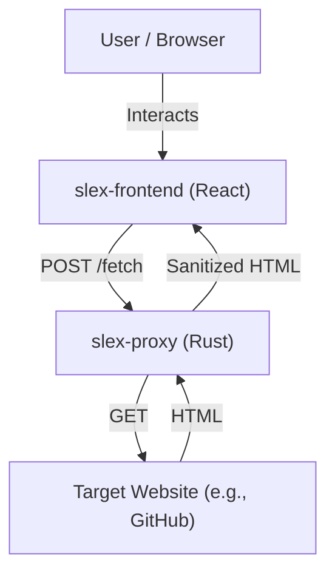

# Slex - DOM Selector and Scraper Tool

## 🏗️ Implementation Design

Slex is designed as a hybrid local/cloud architecture to enable powerful DOM inspection and content extraction while bypassing browser security restrictions (CORS).

### Architecture Overview



1.  **Frontend (`slex-frontend`)**: A React-based Single Page Application (SPA) that provides the UI for entering URLs, inspecting the DOM tree, and generating selectors (CSS/XPath). It renders the fetched content in a sandboxed environment.
2.  **Backend Proxy (`slex-proxy`)**: A lightweight Rust server that acts as a dedicated scraper proxy. It handles:
    *   **CORS Bypass**: Fetches content from any URL, avoiding browser Cross-Origin Resource Sharing restrictions.
    *   **Sanitization (Planned)**: Cleanses HTML to remove malicious scripts before sending it to the client.
    *   **Performance**: Built with Axum and Tokio for high-concurrency async handling.

## 🛠️ Tech Stack

### Frontend (`slex-frontend`)
*   **Framework**: React 18
*   **Build Tool**: Vite
*   **Language**: TypeScript
*   **Styling**: TailwindCSS
*   **State Management**: React Hooks

### Backend (`slex-proxy`)
*   **Language**: Rust (2021 Edition)
*   **Web Framework**: Axum
*   **Async Runtime**: Tokio
*   **HTTP Client**: Reqwest
*   **Logging**: Tracing

## 🚀 Usage

### Prerequisites
*   Node.js (v16+)
*   Rust (cargo)

### Quick Start

We provide a specialized script to start the entire development environment (both frontend and backend) in parallel.

1.  **Start the environment**:
    ```bash
    ./start_dev.sh
    ```
    This script will:
    *   Check if port 3001 is available.
    *   Start the Rust proxy server.
    *   Start the React development server.
    *   Open your browser to `http://localhost:5173`.

2.  **Stop the environment**:
    Press `Ctrl+C` in the terminal to stop both servers.

### Manual Setup
If you prefer to run services individually:

**Terminal 1 (Proxy):**
```bash
cd slex-proxy
cargo run
# Runs on http://0.0.0.0:3001
```

**Terminal 2 (Frontend):**
```bash
cd slex-frontend
npm install
npm run dev
# Runs on http://localhost:5173
```

## 🔮 Future Plan

### Short Term (Optimization)
- [ ] **HTML Sanitization**: Implement server-side scrubbing of `<script>` and `<iframe>` tags using `lol_html`.
- [ ] **Caching**: Add in-memory `moka` cache to `slex-proxy` to reduce redundant fetches.
- [ ] **Docker Support**: Containerize the proxy for easier deployment.

### Mid Term (Features)
- [ ] **Headless Browser Mode**: Integrate `chromiumoxide` or `playwright-rust` to handle JavaScript-heavy sites that require rendering.
- [ ] **Selector API**: Expose an API endpoint that accepts a URL and a selector, returning the extracted text/HTML JSON.

### Long Term (Scale)
- [ ] **Distributed Proxying**: Support rotating proxies to avoid rate limiting.
- [ ] **Project Persistence**: Save and load scraping projects/sessions.
