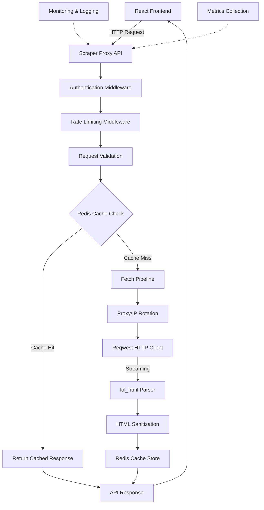

# Dedicated Scraper Proxy - Rust Architecture

## Executive Summary

This document outlines the architecture and implementation strategy for migrating DOM Scraper OS from a client-side proxy fallback system (`api.allorigins.win`) to a production-grade, Rust-based dedicated scraper proxy. This transition provides full control over network requests, caching, security, and performance while enabling enterprise-grade features.

## Current State Analysis

### Existing Client-Side Implementation
- **Proxy Dependency**: Relies on `api.allorigins.win` for CORS bypass
- **Client-Side Processing**: HTML sanitization occurs in browser JavaScript
- **Limited Control**: No request customization, caching, or security filtering
- **Third-Party Risk**: External service dependency with unknown reliability and privacy guarantees

### Target Architecture Benefits
1. **Full Request Control**: Custom headers, timeouts, retry logic, and user agent rotation
2. **Multi-Layer Caching**: Memory, Redis, and HTTP cache respect to reduce load on target sites
3. **Enhanced Security**: Input validation, rate limiting, domain restrictions, and comprehensive sanitization
4. **Performance Optimization**: Streaming HTML parsing, connection pooling, and parallel processing
5. **Production Observability**: Structured logging, metrics, and monitoring integration

## Architecture Overview



## Flow & Tech Stack Review

### Proposed 7-Step Flow Analysis

The architecture follows a logical 7-step pipeline that addresses all critical concerns:

1. **Axum Route** ✅ - Receives target URL with request validation
2. **Tower Middleware** ✅ - Authentication, rate limiting, request tracing via `tracing-subscriber`
3. **Redis Check** ⚠️ - Uses `fred` (recommended) or `redis-rs` for distributed caching
4. **IP Rotation Logic** ✅ - Proxy pool selection with matching `HeaderMap` synchronization
5. **Reqwest Engine** ✅ - Connection-pooled client with streaming support
6. **Processing & Security** ⚠️ - `lol_html` for streaming HTML rewriting with security filters. **Considerations**: Streaming nature may complicate certain sanitization patterns; may need fallback parsing for edge cases; CSS sanitization requires separate processing.
7. **Async Storage** ✅ - Redis caching with TTL and compression

### Alignment Assessment
**Overall Alignment: Excellent** - The flow represents a production-ready pipeline that eliminates third-party dependencies while providing superior performance, security, and control.

## Tech Stack

### Core Framework & Runtime
- **Web Framework**: `Axum` (async, built on `tokio` and `tower`) - Minimal, fast, and extensible. Production-proven with excellent performance.
- **Async Runtime**: `Tokio` with multi-threaded scheduler for high-concurrency I/O operations. Industry standard for async Rust.
- **HTTP Client**: `reqwest` with `brotli`, `gzip` support, SOCKS5 proxy, and connection pooling. Mature, feature-rich, and well-maintained.

### HTML Processing
- **HTML Rewriting**: `lol_html` (Low Latency HTML) - Streaming parser ~10x faster than DOM-based parsers. Processes HTML as it arrives (memory efficient).
- **Streaming vs Buffering**: Small documents (<1MB) buffered, large documents streamed to prevent memory exhaustion
- **Parallel Processing**: `Rayon` for CPU-bound HTML parsing and sanitization tasks. Correct separation from I/O-bound `Tokio` tasks.
- **Sanitization**: Custom rules replicating current client logic with three levels (None/Basic/Strict). Uses `html5ever` or `ammonia` as reference implementations.
- **CSS Processing**: Parallel CSS analysis with `Rayon` for strict sanitization mode

### Caching & Storage
- **In-Memory Cache**: `moka` for LRU cache with TTL support (1000 entries, 5-minute TTL)
- **Distributed Cache**: `fred` recommended over `redis-rs` for better async integration and multiplexed connections
- **Multi-Layer Strategy**: Memory → Redis → Fetch pipeline for optimal performance
- **Configuration**: `config` crate with environment-aware configuration management
- **Cache Key Strategy**: `SHA256(url + options_hash)` for deterministic keys

### Security & Middleware
- **Rate Limiting**: `tower-governor` or custom `tower` middleware
- **Authentication**: JWT validation with `jsonwebtoken`
- **Input Validation**: `validator` crate with custom URL and domain validation
- **Headers Security**: `tower-http` for security headers (CSP, HSTS, etc.)

### Observability
- **Logging**: `tracing` with `tracing-subscriber` and JSON formatting
- **Metrics**: `metrics` crate with `prometheus` exporter
- **Error Handling**: `thiserror` for structured error types, `anyhow` for application errors

### Recommended Additional Crates

| Crate | Purpose | Why Needed |
|-------|---------|------------|
| `moka` | In-memory LRU cache | Reduce Redis load for frequent requests (1000 entries, 5-min TTL) |
| `validator` | Input validation | Validate URLs, domains, configuration parameters |
| `thiserror` + `anyhow` | Error handling | Structured errors + application error context |
| `config` | Configuration management | Environment-aware config (dev/staging/prod) |
| `metrics` + `metrics-exporter-prometheus` | Metrics collection | Production monitoring and alerting |
| `tower-http` | HTTP-specific middleware | Compression, CORS, security headers |
| `tower-governor` | Rate limiting | Robust request throttling per IP/domain |
| `serde` | Serialization/deserialization | JSON request/response handling |
| `url` | URL parsing and manipulation | Safe URL handling and validation |

## Critical Gaps & Recommendations

### 1. Multi-Layer Caching (Essential)
**Current Flow**: Single Redis layer
**Recommendation**: Implement two-layer cache system:
```rust
MemoryCache (moka) → RedisCache (fred) → Fetch Pipeline
```
- **Memory Layer**: 1000 entries, 5-minute TTL for lightning-fast repeat requests
- **Redis Layer**: Distributed cache with compression, 24-hour TTL for cross-instance sharing
- **Benefits**: Reduces Redis load, improves response times for hot content

### 2. Comprehensive Request Validation
**Current Gap**: Basic middleware validation insufficient
**Requirements**:
- URL format and protocol validation (HTTP/HTTPS only)
- Domain allowlist/blocklist (configurable per environment)
- Size limits (max URL length: 2048 chars, max response: 10MB)
- Rate limiting per client + per target domain (prevent abuse)

### 3. Error Handling & Resilience
**Improvements Needed**:
- Structured errors with `thiserror` for API responses
- Graceful degradation (fallback to in-memory cache if Redis fails)
- Circuit breakers for failing target sites (prevent cascading failures)
- Retry logic with jitter and exponential backoff for transient failures

### 4. Security Implementation Details
**Current Client Logic Must Be Replicated**:
1. Remove `<script>`, `<iframe>`, `<object>`, `<embed>` elements
2. Add `target="_blank"` and `rel="noopener noreferrer"` to all `<a>` tags
3. Inject `<base href="...">` if not present in document
4. (Strict mode) Sanitize CSS `url()` and `expression()` values

### 5. Performance Considerations
- **Streaming vs Buffering**: `lol_html` processes HTML as it arrives; buffer small docs (<1MB), stream large ones
- **Connection Pooling**: Optimize `reqwest` client with `pool_max_idle_per_host(20)` and TCP keepalive
- **Parallel Processing Boundaries**: Use `spawn_blocking` for `Rayon` tasks in async contexts

## Core Components

### 1. API Gateway Layer
```rust
// Axum router structure
async fn scraper_api_router() -> Router {
    Router::new()
        .route("/api/v1/fetch", post(fetch_handler))
        .route("/api/v1/health", get(health_check))
        .layer(middleware::from_fn(authentication_middleware))
        .layer(middleware::from_fn(rate_limiting_middleware))
        .layer(middleware::from_fn(request_validation_middleware))
        .layer(Extension(AppState::new()))
}
```

### 2. Request Processing Pipeline
```rust
struct FetchRequest {
    url: String,           // Target URL to scrape
    options: FetchOptions, // Timeout, headers, sanitization level
}

struct FetchOptions {
    timeout_ms: u64,
    follow_redirects: bool,
    sanitize_level: SanitizeLevel, // None, Basic, Strict
    cache_ttl: Option<u64>,        // Custom cache TTL
}
```

### 3. Caching System
- **Layer 1**: In-memory LRU cache (1000 entries, 5-minute TTL)
- **Layer 2**: Redis distributed cache (24-hour TTL, compression)
- **Cache Key**: `SHA256(url + options_hash)` for deterministic keys
- **Cache Invalidation**: Manual purge API and TTL-based expiration

### 4. HTML Sanitization Engine
```rust
enum SanitizeLevel {
    None,      // Raw HTML (for trusted sources)
    Basic,     // Remove scripts, iframes, objects, embeds
    Strict,    // Basic + CSS sanitization, attribute filtering
}

struct HtmlSanitizer {
    rules: SanitizationRules,
    parser: lol_html::HtmlRewriter,
}

impl HtmlSanitizer {
    async fn sanitize(&self, html: &str, level: SanitizeLevel) -> Result<String> {
        // Streaming HTML processing with lol_html
        // Parallel CSS parsing with Rayon
        // Base URL rewriting and link target modification
    }
}
```

### 5. Proxy & IP Rotation
```rust
struct ProxyPool {
    proxies: Vec<ProxyConfig>,
    rotation_strategy: RotationStrategy, // RoundRobin, Random, Sticky
    health_checker: ProxyHealthChecker,
}

struct ProxyConfig {
    address: String,      // socks5:// or http://
    credentials: Option<ProxyCredentials>,
    headers: HeaderMap,   // Custom headers per proxy
    region: Option<String>,
}
```

## Implementation Phases

**Priority Order**: Core functionality first, production features second, optimization last. Each phase builds on the previous with incremental value delivery.

### Phase 1: Foundation (Week 1-2)
1. **Basic Axum Server** with health check endpoint
2. **Configuration system** with environment variables
3. **Structured logging** with `tracing`
4. **Basic request validation** (URL format, domain allowlist)
5. **Simple reqwest client** with timeout and redirect handling

### Phase 2: Core Functionality (Week 3-4)
1. **HTML sanitization** with `lol_html` (mimic current client-side logic)
2. **In-memory caching** with `moka`
3. **Error handling** and structured error responses
4. **Basic rate limiting** per IP address
5. **Integration tests** with mock HTTP responses

### Phase 3: Production Features (Week 5-6)
1. **Redis integration** for distributed caching
2. **Proxy/IP rotation** system
3. **Advanced sanitization** levels and customization
4. **Metrics collection** with Prometheus
5. **Authentication middleware** (optional, for private deployments)

### Phase 4: Optimization & Monitoring (Week 7-8)
1. **Connection pooling** and reuse
2. **Streaming response processing**
3. **Performance benchmarking** and optimization
4. **Monitoring dashboard** (Grafana)
5. **Alerting rules** for error rates and latency

## Frontend Integration

### API Contract
```typescript
interface FetchRequest {
  url: string;
  options?: {
    timeout?: number;          // milliseconds
    sanitize?: 'none' | 'basic' | 'strict';
    cache_ttl?: number;       // seconds
  };
}

interface FetchResponse {
  html: string;
  metadata: {
    url: string;
    final_url?: string;
    status_code: number;
    content_type: string;
    size_bytes: number;
    processing_time_ms: number;
    cached: boolean;
  };
}
```

### React Integration
Update `App.tsx:82-106` to use the new proxy:

```typescript
// Current implementation
const proxyUrl = `https://api.allorigins.win/raw?url=${encodeURIComponent(newUrl)}`;

// New implementation
const fetchFromProxy = async (url: string, options?: FetchOptions) => {
  const response = await fetch('http://localhost:8080/api/v1/fetch', {
    method: 'POST',
    headers: { 'Content-Type': 'application/json' },
    body: JSON.stringify({ url, options }),
  });

  if (!response.ok) {
    // Fallback to old proxy during transition
    return fallbackToAllOrigins(url);
  }

  const data = await response.json();
  return data.html;
};
```

### Migration Strategy
1. **Feature Flag**: Toggle between old and new proxy
2. **Graceful Degradation**: Fallback to `api.allorigins.win` on proxy failure
3. **Progressive Rollout**: Start with internal testing, then beta users
4. **Monitoring**: Track success rates, latency, and error patterns

## Security Considerations

### Input Validation
```rust
async fn validate_fetch_request(request: &FetchRequest) -> Result<()> {
    // URL format validation
    let parsed_url = Url::parse(&request.url)?;

    // Domain allowlist/blocklist
    if !is_allowed_domain(parsed_url.host_str()) {
        return Err(Error::DomainNotAllowed);
    }

    // Protocol restrictions (HTTP/HTTPS only)
    if parsed_url.scheme() != "http" && parsed_url.scheme() != "https" {
        return Err(Error::InvalidProtocol);
    }

    // Rate limiting per client IP
    check_rate_limit(request.client_ip).await?;

    Ok(())
}
```

### HTML Sanitization Rules
1. **Script Removal**: All `<script>` elements and `javascript:` protocols
2. **Iframe/Embed Removal**: Prevent embedded content execution
3. **Link Modification**: Add `target="_blank"` and `rel="noopener noreferrer"`
4. **Base URL Injection**: Ensure relative URLs resolve correctly
5. **Attribute Filtering**: Remove `on*` event handlers and dangerous attributes
6. **CSS Sanitization** (Strict mode): Remove `url()` and `expression()` values

### Request Security
- **Timeout Enforcement**: Default 30-second timeout, configurable per request
- **Size Limits**: Maximum 10MB response size to prevent memory exhaustion
- **Redirect Limits**: Maximum 5 redirects to avoid loops
- **User-Agent Rotation**: Avoid detection and blocking by target sites

### Security Policy Configuration
```rust
struct SecurityPolicy {
    // Request limits
    max_response_size: usize,           // 10MB default
    max_redirects: u8,                  // 5 default
    timeout_seconds: u64,               // 30 seconds default

    // Protocol restrictions
    allowed_protocols: Vec<&'static str>, // ["http", "https"]

    // Domain controls
    domain_allowlist: Option<Vec<String>>, // None = allow all
    domain_blocklist: Vec<String>,        // ["localhost", "127.0.0.1", "internal.*"]

    // Sanitization levels
    default_sanitize_level: SanitizeLevel, // Basic

    // Rate limiting
    requests_per_minute: u32,            // 60 default
    burst_capacity: u32,                 // 10 default
}

// Configuration example for production
let production_policy = SecurityPolicy {
    max_response_size: 10 * 1024 * 1024, // 10MB
    max_redirects: 5,
    timeout_seconds: 30,
    allowed_protocols: vec!["http", "https"],
    domain_allowlist: None,              // Allow all domains
    domain_blocklist: vec![
        "localhost".to_string(),
        "127.0.0.1".to_string(),
        "192.168.*".to_string(),
        "10.*".to_string(),
        "172.16.*".to_string(),
    ],
    default_sanitize_level: SanitizeLevel::Basic,
    requests_per_minute: 60,
    burst_capacity: 10,
};
```

## Caching Strategy

### Multi-Layer Cache Architecture
```rust
struct CacheSystem {
    memory: MemoryCache,  // Fast, limited capacity
    redis: RedisCache,    // Distributed, persistent
}

impl CacheSystem {
    async fn get(&self, key: &str) -> Option<CachedResponse> {
        // Check memory cache first
        if let Some(cached) = self.memory.get(key) {
            metrics::increment_cache_hit("memory");
            return Some(cached);
        }

        // Check Redis cache
        if let Some(cached) = self.redis.get(key).await {
            // Populate memory cache
            self.memory.set(key, cached.clone());
            metrics::increment_cache_hit("redis");
            return Some(cached);
        }

        metrics::increment_cache_miss();
        None
    }
}
```

### Cache Invalidation
- **TTL-based**: Default 24 hours for successful responses
- **Error caching**: 5 minutes for error responses (prevents hammering failing sites)
- **Manual purge**: Administrative API to clear cache by domain or pattern
- **Conditional requests**: Respect `ETag` and `Last-Modified` headers when possible

## Performance Optimizations

### Performance Considerations

#### Streaming vs Buffering Strategy
- **Small Documents (<1MB)**: Buffer entirely for simpler processing
- **Large Documents (≥1MB)**: Stream through `lol_html` to avoid memory exhaustion
- **Hybrid Approach**: Stream through `lol_html` for basic sanitization, buffer for complex operations

#### Connection Pooling Optimization
```rust
// Optimized reqwest client configuration
let client = reqwest::Client::builder()
    .pool_max_idle_per_host(20)          // Reuse connections
    .pool_idle_timeout(Duration::from_secs(90))  // Keep alive
    .tcp_keepalive(Duration::from_secs(60))      // TCP keepalive
    .timeout(Duration::from_secs(30))            // Total timeout
    .connect_timeout(Duration::from_secs(10))    // Connection timeout
    .user_agent("Mozilla/5.0 (compatible; DOM-Scraper/1.0)") // Default UA
    .build()?;
```

#### Parallel Processing Boundaries
- **I/O-bound**: `Tokio` async tasks (network requests, Redis operations)
- **CPU-bound**: `Rayon` parallel iterators (HTML parsing, CSS analysis)
- **Boundary Crossing**: Use `tokio::task::spawn_blocking` for `Rayon` tasks in async contexts
- **Thread Pool Sizing**: Default `Rayon` thread pool (num_cpus) typically sufficient

### Connection Pooling
```rust
// Reqwest client with connection pool
let client = reqwest::Client::builder()
    .pool_max_idle_per_host(20)
    .timeout(Duration::from_secs(30))
    .tcp_keepalive(Duration::from_secs(60))
    .build()?;
```

### Streaming Processing
```rust
async fn process_streaming_response(response: reqwest::Response) -> Result<String> {
    let mut stream = response.bytes_stream();
    let mut processor = HtmlStreamProcessor::new();

    while let Some(chunk) = stream.next().await {
        let chunk = chunk?;
        processor.process_chunk(&chunk).await?;
    }

    processor.finalize().await
}
```

### Parallel Processing
```rust
// Use Rayon for CPU-bound HTML parsing
let sanitized_html = html_chunks
    .par_iter()
    .map(|chunk| sanitize_chunk(chunk, &rules))
    .collect::<Result<Vec<_>>>()?
    .concat();
```

## Deployment Options

### Development Setup
```dockerfile
FROM rust:1.75-alpine AS builder
WORKDIR /app
COPY . .
RUN cargo build --release

FROM alpine:latest
RUN apk add --no-cache ca-certificates
COPY --from=builder /app/target/release/scraper-proxy /usr/local/bin/
EXPOSE 8080
CMD ["scraper-proxy"]
```

### Kubernetes Deployment
```yaml
apiVersion: apps/v1
kind: Deployment
metadata:
  name: scraper-proxy
spec:
  replicas: 3
  strategy:
    rollingUpdate:
      maxSurge: 1
      maxUnavailable: 0
  template:
    spec:
      containers:
      - name: scraper-proxy
        image: scraper-proxy:latest
        ports:
        - containerPort: 8080
        env:
        - name: REDIS_URL
          value: "redis://redis-service:6379"
        - name: RUST_LOG
          value: "info"
        resources:
          requests:
            memory: "256Mi"
            cpu: "250m"
          limits:
            memory: "512Mi"
            cpu: "500m"
```

### Configuration Management
```toml
# config/production.toml
[server]
port = 8080
workers = 4
max_body_size = "10MB"

[redis]
url = "redis://production-redis:6379"
pool_size = 10

[cache]
memory_size = 1000
default_ttl = 86400
error_ttl = 300

[security]
allowed_domains = ["*"]
blocked_domains = ["localhost", "127.0.0.1", "internal.*"]
rate_limit_per_minute = 60
```

## Monitoring & Observability

### Metrics Collection
```rust
// Prometheus metrics
lazy_static! {
    static ref REQUESTS_TOTAL: IntCounter = register_int_counter!(
        "scraper_requests_total",
        "Total number of requests"
    ).unwrap();

    static ref REQUEST_DURATION: Histogram = register_histogram!(
        "scraper_request_duration_seconds",
        "Request duration in seconds"
    ).unwrap();

    static ref CACHE_HITS: IntCounter = register_int_counter!(
        "scraper_cache_hits_total",
        "Total cache hits by layer"
    ).unwrap();
}
```

### Health Checks
```rust
async fn health_check() -> impl IntoResponse {
    let checks = vec![
        health_check_redis().await,
        health_check_memory().await,
        health_check_external().await,
    ];

    let all_healthy = checks.iter().all(|c| c.is_healthy());
    let status = if all_healthy { StatusCode::OK } else { StatusCode::SERVICE_UNAVAILABLE };

    Json(HealthResponse { checks, status: all_healthy })
}
```

### Logging Structure
```json
{
  "timestamp": "2024-01-15T10:30:00Z",
  "level": "INFO",
  "request_id": "abc123",
  "url": "https://example.com",
  "client_ip": "192.168.1.1",
  "duration_ms": 245,
  "cache_hit": false,
  "response_size": 15342,
  "status_code": 200
}
```

## Testing Strategy

### Unit Tests
```rust
#[cfg(test)]
mod tests {
    use super::*;

    #[tokio::test]
    async fn test_html_sanitization() {
        let sanitizer = HtmlSanitizer::new(SanitizeLevel::Strict);
        let input = r#"<script>alert("xss")</script><p>Safe content</p>"#;
        let output = sanitizer.sanitize(input).await.unwrap();
        assert!(!output.contains("script"));
        assert!(output.contains("Safe content"));
    }
}
```

### Integration Tests
```rust
#[tokio::test]
async fn test_full_fetch_pipeline() {
    let app = test_app().await;
    let client = TestClient::new(app);

    let response = client
        .post("/api/v1/fetch")
        .json(&FetchRequest {
            url: "https://httpbin.org/html".to_string(),
            options: None,
        })
        .send()
        .await;

    assert_eq!(response.status(), StatusCode::OK);
    let body = response.json::<FetchResponse>().await;
    assert!(body.html.contains("<html>"));
}
```

### Load Testing
- **Locust** or **k6** for simulating concurrent users
- **Target**: 100 requests/second with <100ms p95 latency
- **Failure testing**: Simulate Redis downtime, network failures

## Migration Plan

### Phase 1: Development & Testing (2 weeks)
1. Implement core proxy functionality
2. Create comprehensive test suite
3. Set up CI/CD pipeline
4. Internal testing with mock frontend

### Phase 2: Staged Rollout (1 week)
1. Deploy to staging environment
2. Update frontend with feature flag
3. Monitor performance and error rates
4. Gather feedback from beta users

### Phase 3: Production Migration (1 week)
1. Deploy to production with limited traffic
2. Gradually increase traffic percentage
3. Maintain fallback to `api.allorigins.win`
4. Monitor success rates and user impact

### Phase 4: Optimization & Scaling (Ongoing)
1. Performance tuning based on real-world usage
2. Scale based on traffic patterns
3. Implement advanced features (custom sanitization rules, etc.)

## Risk Assessment & Mitigation

### Risk Levels by Component

#### 🔴 **High Risk**
1. **Performance Under Load**
   - **Risk**: Inadequate performance under production traffic
   - **Mitigation**: Thorough load testing (100+ req/sec), performance profiling, auto-scaling
   - **Detection**: Latency metrics, error rates, queue depth monitoring

2. **Security Bypass Possibilities**
   - **Risk**: HTML sanitization misses dangerous patterns
   - **Mitigation**: Comprehensive security review, OWASP testing, fuzz testing
   - **Detection**: Security scanning, penetration testing

3. **HTML Sanitization Completeness**
   - **Risk**: Missing edge cases in malformed HTML
   - **Mitigation**: Test suite with real-world HTML samples, include adversarial examples
   - **Detection**: Comparison with established sanitizers (Ammonia, Bleach)

#### 🟡 **Medium Risk**
1. **`lol_html` Streaming Parsing Edge Cases**
   - **Risk**: Unexpected behavior with malformed HTML
   - **Mitigation**: Comprehensive HTML test corpus, fallback parsing for errors
   - **Detection**: Error monitoring, HTML validation checks

2. **Proxy Rotation Reliability**
   - **Risk**: Proxy pool degradation, IP blocking
   - **Mitigation**: Health checking, circuit breakers, multiple proxy providers
   - **Detection**: Success rate monitoring per proxy, response time tracking

3. **Redis Dependency**
   - **Risk**: Cache layer failure impacts performance
   - **Mitigation**: Graceful degradation to in-memory only, Redis replication
   - **Detection**: Redis health checks, cache hit rate monitoring

#### 🟢 **Low Risk**
1. **Core Framework Stability** (Axum, Tokio, Reqwest)
   - **Risk**: Framework bugs or performance issues
   - **Mitigation**: Use stable versions, comprehensive testing
   - **Detection**: Dependency updates, community monitoring

2. **Basic HTML Sanitization Logic**
   - **Risk**: Simple rule implementation errors
   - **Mitigation**: Unit tests for each sanitization rule
   - **Detection**: Automated testing, code review

### Mitigation Strategy

#### Technical Risk Mitigation
1. **HTML Parsing Bugs**: Comprehensive test suite with real-world HTML samples, adversarial testing
2. **Memory Leaks**: Regular load testing with memory profiling, allocation tracking
3. **Redis Dependency**: Multi-layer caching (memory → Redis), graceful degradation
4. **Proxy Blocking**: Rotating user agents, IP addresses, request pattern randomization

#### Operational Risk Mitigation
1. **Service Outage**: Health checks, automatic failover, circuit breakers
2. **Data Loss**: Redis persistence configuration, regular backups, replication
3. **Security Breaches**: Regular security audits, dependency updates, vulnerability scanning
4. **Cost Overruns**: Resource monitoring, alerting, auto-scaling policies

## Success Metrics

### Performance Metrics
- **Latency**: p95 < 500ms for cache misses, < 50ms for cache hits
- **Throughput**: Support 100+ requests/second per instance
- **Cache Hit Rate**: Target > 60% for repeat requests
- **Error Rate**: < 1% of total requests

### Business Metrics
- **User Satisfaction**: Reduced load times and improved reliability
- **Cost Reduction**: Elimination of third-party proxy dependency
- **Feature Enablement**: New capabilities (custom sanitization, caching control)
- **Security Improvement**: Reduced attack surface and better compliance

## Conclusion

**Review Summary**: The proposed 7-step flow and Rust tech stack are fundamentally sound and provide an excellent foundation for a production scraper proxy. The architecture successfully addresses all critical concerns while eliminating third-party dependencies.

This Rust-based scraper proxy architecture provides a production-grade solution that addresses the limitations of the current client-side proxy approach. By leveraging Rust's performance and safety guarantees, combined with a carefully designed architecture, we can create a scalable, secure, and maintainable system that serves as a foundation for future enhancements.

The key improvements identified - multi-layer caching, comprehensive request validation, enhanced error handling, and detailed security policies - have been integrated into the architecture. The phased implementation approach minimizes risk while delivering incremental value, and the comprehensive monitoring and testing strategies ensure reliability in production environments.

**Final Assessment**: The proposed flow and tech stack represent a production-ready solution that will provide superior performance, security, and control compared to the current client-side proxy approach.